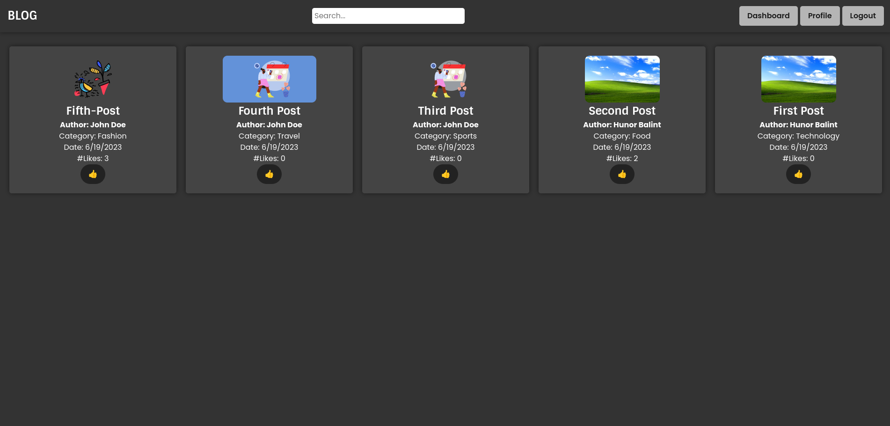

# Blog Project with EJS, EXPRESS and MYSQL

## Description

This project was made for webtechnologies exam.

## Features

### Implemented

- [x] Login and Registration
- [x] Session management with JWT
- [x] Admin dashboard for managing posts
- [x] Create post if the user has appropiate role
- [x] Update post if the user has appropiate role
- [x] Delete post if the user has appropiate role
- [x] View all posts
- [x] Search for a post (title and content only)
- [x] View a specific post
- [x] View a specific user and its infos (including name, role, email, posts that he/she wrote)
- [x] Like and unlike system for posts
- [x] Create comments on a post if the user is logged in

### Not Implemented yet

- [ ] Edit comments if the user has appropriate rule
- [ ] Delete comments if the user has appropriate rule
- [ ] Add user from admin dashboard
- [ ] Edit user from admin dashboard
- [ ] Delete user from admin dashboard
- [ ] Filter posts by category (category system is implemented, only the filter is missing)
- [ ] Add categories from admin dashboard
- [ ] Edit categories from admin dashboard
- [ ] Delete categories from admin dashboard
- [ ] Make the UI more responsive

## Installation

1. Clone the repository

   ```console
   git clone https://github.com/MemerGamer/express-ejs-blog.git
   ```

2. Install npm packages

   ```console
    npm install
   ```

3. Create a .env file

   ```console
   cp .env.example .env
   ```

4. Create a database with the name "blog", and configure it following [db.sql](./db-queries/db.sql)

5. Run the project
   ```console
   npm run test:nm
   ```
